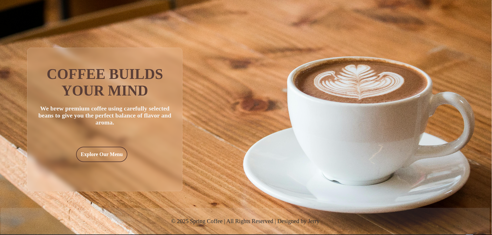

# coffee-shop-website
Spring Coffee is a responsive multi-page coffee shop website designed using HTML and CSS. The project uses on clean UI design, mobile-first responsiveness, reusable styles, and real-world layout structure. It includes animated elements, and visually engaging menu cards. The project demonstrates strong fundamentals in Frontend development.

# coffee-shop-website
# ☕ Spring Coffee Website

A modern, fully responsive coffee shop website built with **HTML and CSS**, featuring smooth animations, hover effects, and a mobile-friendly navigation system.

This project simulates a real-world coffee shop website with multiple pages and a clean UI suitable for both desktop and mobile devices.

---

## 🚀 Live Demo
👉 https://af-jerry.github.io/coffee-shop-website/

---

## 📸 Preview

---

## ✨ Features
- Responsive design (mobile, tablet, desktop)
- Hamburger menu for small screens
- Multiple pages:
  - Home
  - About
  - Menu
  - Order
  - Contact
- Modern UI with hover effects and animations
- Card-based menu layout with background images
- Shared global stylesheet for consistency
- Clean and semantic HTML structure

---

## 🛠️ Built With
- **HTML5**
- **CSS3**
- Flexbox & CSS Grid
- Media Queries (Responsive Design)

---

## 📂 Project Structure
spring-coffee/
│── index.html
│── about.html
│── menu.html
│── order.html
│── contact.html
│
│── styles.css
│
│── images/
│ ├── background.jpg
│ ├── espresso.jpg
│ ├── cappuccino.jpg
│ └── latte.jpg

---

## 📱 Responsive Design
The website is fully responsive and optimized for:
- Desktop screens
- Tablets
- Mobile phones

The navigation automatically switches to a hamburger menu on smaller screens.

---

## 🎯 Purpose of This Project
This project was built to:
- Practice responsive web design
- Improve HTML & CSS structuring
- Understand real-world website layouts
- Build a portfolio-ready frontend project

---

## 📌 Future Improvements
- Add JavaScript for enhanced interactivity
- Implement an online ordering system
- Connect to a backend (Node.js / Python)
- Add animations using GSAP or CSS keyframes
- Improve accessibility (ARIA roles)

---

## 👨‍💻 Author
**Jerry Afevi**  
Frontend / Backend Developer (In Progress)  
📍 Ghana

- GitHub: https://github.com/af-jerry
